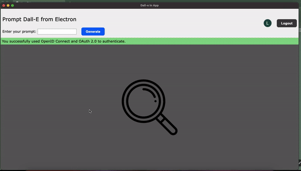

# Dall-E In App

A user interface for Dall-E using the `CreateImage` API. 



## Authentication
The user is required to authenticate using AuthO. All the steps and file structure are taken from this [article/tutorial](https://auth0.com/blog/securing-electron-applications-with-openid-connect-and-oauth-2/).<br>
Once authenticated, the user's profile image is displayed along with the name (which has been removed for video recording).
Requests to the OpenAI API are unrelated to this auth process, this is only for learning purposes, but it protects the home page.

## Prompts to Dall-E
Once logged into the app, the user can enter a prompt to create an image. If cloning this repository, you will need to request an API key to OpenAI and enter it in the `env-variables.json`.

## Technical Details
The environment variables have been ignored, so you will need to create a file named `env-variables.json` in the root of the project and add the following:
```
{
    "auth0Domain": "<your_authO_domain>",
    "clientId": "<your_client_id>",
    "openAIKey": "<your_openai_key>"
}
```
<br>

All requests are made by the main process. When the app starts, refresh tokens are checked and if they are valid, the home page is rendered. Otherwise, the authentication window is shown for the user to login using the AuthO URLs.
OpenAI requests are also made through the main process. The renderer process sends the prompt to main process using `invoke - handle`.